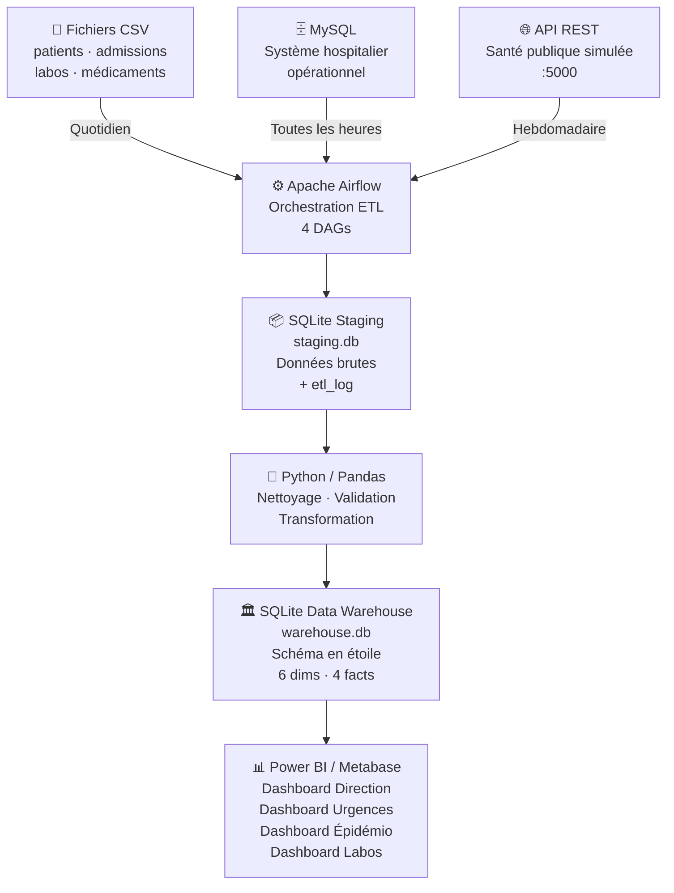

# Healthcare Analytics Platform

Plateforme Data Engineering complète pour l'analyse des données hospitalières et de santé publique. Conçue comme projet portfolio démontrant une architecture ETL moderne avec orchestration Airflow, Data Warehouse en étoile et dashboards BI.

---

## Architecture



### Composants

| Composant | Rôle |
|-----------|------|
| **CSV** | Données exportées des systèmes administratifs (patients, admissions, biologie) |
| **MySQL** | Base opérationnelle simulant un SIH (Système d'Information Hospitalier) |
| **API REST** | Service Flask simulant un portail de santé publique régionale |
| **Apache Airflow** | Orchestrateur ETL — planification, retry, monitoring des 4 DAGs |
| **Staging SQLite** | Zone tampon : données brutes avec traçabilité (etl_log) |
| **Warehouse SQLite** | Data Warehouse en étoile avec dimensions et tables de faits |
| **BI Tools** | Connexion native SQLite pour Power BI Desktop et Metabase |

---

## Stack technique

| Technologie | Version | Rôle |
|-------------|---------|------|
| Python | 3.10+ | ETL, génération de données, API |
| Apache Airflow | 2.8.x | Orchestration des pipelines |
| SQLite | 3.x | Staging & Data Warehouse |
| MySQL | 8.x (optionnel) | Source opérationnelle |
| Pandas | 2.1 | Transformations tabulaires |
| SQLAlchemy | 2.0 | Abstraction base de données |
| Flask | 3.0 | API REST mock |
| Faker | 22.x | Génération de données réalistes |
| Power BI Desktop | latest | Dashboards (Windows) |
| Metabase | latest | Dashboards (cross-platform) |

---

## Structure du projet

```
healthcare-analytics/
├── airflow/
│   └── dags/
│       ├── ingestion_csv_patients.py    # DAG quotidien patients/sorties
│       ├── ingestion_csv_admissions.py  # DAG quotidien admissions/labos/médicaments
│       ├── ingestion_mysql.py           # DAG horaire extraction MySQL incrémentale
│       └── ingestion_api_maladies.py    # DAG hebdomadaire API épidémio
├── api/
│   └── mock_api.py                      # API Flask (maladies, épidémies, régions)
├── config/
│   ├── config.yaml                      # Configuration principale
│   └── config_template.yaml            # Template sans données sensibles
├── data/                                # Fichiers CSV générés
│   ├── patients.csv         (100 lignes)
│   ├── admissions.csv       (500 lignes)
│   ├── sorties.csv          (~450 lignes)
│   ├── laboratoires.csv     (1000 lignes)
│   ├── medicaments.csv      (500 lignes)
│   ├── hopitaux.csv         (20 lignes)
│   ├── services.csv         (15 lignes)
│   ├── regions.csv          (13 lignes)
│   └── maladies.csv         (20 lignes)
├── docs/
│   └── architecture.md
├── scripts/
│   ├── generate_data.py     # Génération données Faker (fr_FR)
│   ├── db_utils.py          # Connexions et utilitaires DB partagés
│   ├── extract_csv.py       # Extraction CSV → staging
│   ├── extract_mysql.py     # Extraction MySQL incrémentale → staging
│   ├── extract_api.py       # Extraction API REST → staging
│   ├── transform.py         # Staging → dimensions et facts warehouse
│   └── init_project.py      # Script d'initialisation tout-en-un
├── sql/
│   ├── create_warehouse.sql # Schéma Data Warehouse (star schema)
│   ├── create_staging.sql   # Schéma zone staging
│   ├── kpi_queries.sql      # 15 requêtes KPI nommées
│   └── create_mysql_tables.sql
├── staging/                 # staging.db créé automatiquement
├── warehouse/               # warehouse.db créé automatiquement
├── tests/
│   └── test_etl.py          # Suite pytest (schema, qualité, ETL)
├── logs/
├── requirements.txt
└── README.md
```

---

## Installation locale

### Prérequis

- Python 3.10 ou supérieur
- Git
- SQLite 3 (inclus avec Python)
- MySQL 8.x *(optionnel)*

### 1. Cloner et configurer l'environnement

```bash
git clone <repo-url> healthcare-analytics
cd healthcare-analytics

python -m venv venv
source venv/bin/activate          # Linux / macOS
# venv\Scripts\activate           # Windows

pip install -r requirements.txt
```

### 2. Adapter la configuration

```bash
cp config/config.yaml config/config.yaml.backup
# Éditez config/config.yaml si nécessaire (les chemins sont auto-détectés)
```

### 3. Initialisation complète en une commande

```bash
python scripts/init_project.py
```

Ce script enchaîne automatiquement : génération CSV → staging → warehouse → vérification.

---

## Installation d'Apache Airflow (local, sans Docker)

```bash
# Dans le virtualenv activé
export AIRFLOW_HOME=$(pwd)/airflow
pip install apache-airflow==2.8.1

airflow db init

# Créer un utilisateur admin
airflow users create \
    --username admin --password admin \
    --firstname Admin --lastname User \
    --role Admin --email admin@example.com

# Indiquer le dossier des DAGs
# Éditez airflow/airflow.cfg :
# dags_folder = /chemin/absolu/vers/healthcare-analytics/airflow/dags

# Démarrer Airflow (mode standalone pour dev)
airflow standalone
```

Accès UI : http://localhost:8080 (admin / admin)

---

## Installation optionnelle MySQL

```bash
# Ubuntu/Debian
sudo apt install mysql-server
sudo mysql_secure_installation

# Créer la base et l'utilisateur
mysql -u root -p < sql/create_mysql_tables.sql

mysql -u root -p -e "
  CREATE USER 'healthcare_user'@'localhost' IDENTIFIED BY 'healthcare_pass';
  GRANT SELECT ON healthcare_db.* TO 'healthcare_user'@'localhost';
  FLUSH PRIVILEGES;
"
```

---

## Exécution sans Airflow (scripts directs)

```bash
# 1. Démarrer l'API mock (terminal séparé)
python api/mock_api.py

# 2. Extraire les CSV vers le staging
python scripts/extract_csv.py

# 3. Extraire l'API vers le staging (optionnel, API doit tourner)
python scripts/extract_api.py

# 4. Transformer staging → Data Warehouse
python scripts/transform.py
```

---

## Exécution des DAGs Airflow

```bash
# Tester un DAG manuellement
airflow dags test ingestion_csv_patients 2024-01-01

# Déclencher manuellement depuis l'UI ou CLI
airflow dags trigger ingestion_csv_patients
airflow dags trigger ingestion_csv_admissions
airflow dags trigger ingestion_api_maladies
airflow dags trigger ingestion_mysql
```

---

## Connexion Power BI

1. Ouvrir Power BI Desktop
2. **Obtenir les données** → **Base de données** → **Base de données SQLite**
3. Chemin : `C:\...\healthcare-analytics\warehouse\warehouse.db`
4. Sélectionner les tables `dim_*` et `fact_*`
5. Créer les relations (modèle en étoile est déjà structuré)

---

## Connexion Metabase

```bash
# Installer Metabase (JAR)
wget https://downloads.metabase.com/v0.48.0/metabase.jar
java -jar metabase.jar
```

1. Accès : http://localhost:3000
2. **Admin** → **Bases de données** → **Ajouter une base de données**
3. Type : **SQLite**, chemin absolu vers `warehouse/warehouse.db`

---

## Modèle de données (schéma en étoile)

```
                    dim_temps
                       │
dim_region ─── dim_patient ──── fact_admissions ──── dim_hopital
                                        │
                              dim_service  dim_maladie

                    fact_urgences ──── dim_hopital
                    fact_laboratoires ─ dim_hopital
                    fact_prescriptions ─ dim_service
```

### Dimensions

| Table | Description |
|-------|-------------|
| `dim_patient` | Tranche d'âge, sexe, région |
| `dim_temps` | Date complète : jour, mois, trimestre, week-end (2022–2026) |
| `dim_hopital` | Établissement, capacité en lits, type (CHU/CH/Clinique) |
| `dim_service` | Service médical, spécialité, nb de lits |
| `dim_region` | Région française, population, superficie |
| `dim_maladie` | Diagnostic CIM-10, catégorie, gravité 1–5 |

### Tables de faits

| Table | Granularité | Mesures clés |
|-------|-------------|--------------|
| `fact_admissions` | 1 ligne = 1 séjour hospitalier | durée séjour, coût, urgence, réadmission |
| `fact_urgences` | 1 ligne = 1 passage aux urgences | temps d'attente, niveau urgence, disposition |
| `fact_laboratoires` | 1 ligne = 1 analyse biologique | résultat numérique, est_anormal |
| `fact_prescriptions` | 1 ligne = 1 prescription | médicament, durée, chronicité |

---

## KPI disponibles

Toutes les requêtes sont dans `sql/kpi_queries.sql`.

| KPI | Description |
|-----|-------------|
| Taux d'occupation des lits | Admissions actives / capacité × 100 |
| Durée moyenne de séjour | Par service, par mois |
| Admissions par jour | 30 derniers jours, urgentes vs programmées |
| Top 10 maladies | Fréquence avec % du total |
| Cas par région | Taux pour 100 000 habitants |
| Répartition par âge | Tranches 0-17 / 18-30 / 31-50 / 51-65 / 65+ |
| Taux de réadmission | Par service |
| Temps d'attente urgences | Moyenne mensuelle par hôpital |
| Résultats labo anormaux | Taux d'anomalie par type de test |
| Taux d'incidence | Par région et par maladie (pour 100 000 hab.) |

---

## Dashboards BI

### Dashboard Direction
- Taux d'occupation des lits par hôpital
- Admissions et sorties quotidiennes (graphique linéaire)
- Durée moyenne de séjour par service (barres)
- Coût moyen par séjour

### Dashboard Santé Publique
- Top 10 maladies (barres horizontales)
- Cas par région (carte choroplèthe)
- Répartition par tranche d'âge (camembert)
- Évolution mensuelle (courbe tendance)

### Dashboard Urgences
- Nombre de passages aux urgences (carte KPI)
- Temps d'attente moyen en minutes
- Pic d'activité par heure / jour de semaine
- Taux d'hospitalisation après passage urgences

### Dashboard Laboratoires
- Volume de tests par type (barres)
- Taux d'anomalie par analyse (gauge)
- Évolution des tests anormaux dans le temps

---

## Lancer les tests

```bash
pytest tests/ -v
pytest tests/ -v --tb=short    # Affichage compact des erreurs
pytest tests/ -v -k "schema"   # Filtrer par nom de test
```

---

## Évolutions futures

- [ ] Passage à DuckDB pour meilleures performances analytiques
- [ ] API réelle (data.gouv.fr / Santé Publique France)
- [ ] Modèle de prévision des admissions (Prophet / sklearn)
- [ ] Alertes automatiques sur seuils (email, Slack)
- [ ] Containerisation complète avec Docker Compose
- [ ] dbt pour les transformations SQL versionnées
- [ ] Great Expectations pour la qualité des données
- [ ] Tableau de bord temps réel avec Grafana + SQLite

---